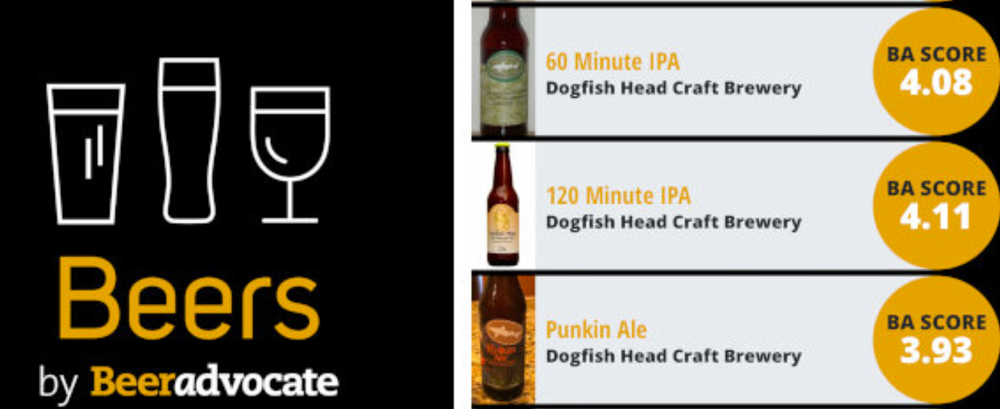

# Beeradvocate-Text-Analytics
  

This project is a part of the coursework for Text Analytics at the University of Texas at Austin. Here we scraped Beeradvocate.com and implemented various text mining concepts to analyze the reviews on various craft beers and build a recommendation system.

## Table of contents
- [Business Problem](https://github.com/anshikaahuja/Crowdsourced-Recommendation-System-Beeradvocate/blob/master/README.md#introduction)
- [Data Used](https://github.com/anshikaahuja/Crowdsourced-Recommendation-System-Beeradvocate/blob/master/README.md#data-used)
- [Approach](https://github.com/anshikaahuja/Crowdsourced-Recommendation-System-Beeradvocate/blob/master/README.md#approach)
- [Algorithms/Libraries Used](https://github.com/anshikaahuja/Crowdsourced-Recommendation-System-Beeradvocate/blob/master/README.md#algorithmslibraries-used)
- [Analysis and Insights](https://github.com/anshikaahuja/Crowdsourced-Recommendation-System-Beeradvocate/blob/master/README.md#analysis-and-insights)

## Business Problem
Beeradvocate.com is an online forum for beers. People use this website to post reviews about their experience with various beers as well as provide ratings for the beers. The objective of the project was to create the building blocks of a crowdsourced recommendation system. The recommendation system was required to accept user inputs about desired attributes of a product and come up with 3 recommendations.

## Data Used
We scraped around 6000 reviews about various craft beers from [BeerAdvocate](https://www.beeradvocate.com/beer/top-rated/) using Selenium. The scraped data can be found in `data.csv`

## Approach
In this project the following steps were taken:
1. Write a scraper using Selenium on python to fetch posts from Beeradvocate.com
2. Identify 3 attributes assuming that a customer who will be using this recommendation system has specified 3 attributes in a beer
3. Perform a similarity analysis with the 3-attribute set and the reviews using [SPACY](https://github.com/explosion/spaCy) and choose 300 reviews that have the highest similarity scores.
4. Perform sentiment analysis using [VADER](https://github.com/cjhutto/vaderSentiment) on these 300 reviews and sort them by the sentiment scores.
5. Based on the above steps, recommend 3 beers to the customer.
6. Identify the highest rated beers by calculating average ratings for each beer and ignoring the similarity and sentiment scores.
[Analysis.ipnyb](https://github.com/anshikaahuja/Crowdsourced-Recommendation-System-Beeradvocate/blob/master/Analysis.ipynb) file has the code for the analysis

## Algorithms/Libraries Used
- Scraping using Selenium
- Word Frequency analysis using NLTK
- Similarity Analysis using SPACY
- Sentiment Analysis using VADER

## Analysis and Insights
 
**1. Attributes chosen**

**Hoppy:** Herbal, earthy, spicy, or citric aromas and flavors of hops                                                                   
**Complex:** Multidimensional; many flavors and sensations on the palate                                                                 
**Crisp:** Highly carbonated; effervescent

**2. Top Reviews with highest similarity scores**

Beer Name | Rating | Similarity score
------------ | ------------- | -------------
Heavy Mettle | 4.74 | 0.879106
Abrasive Ale | 4.77 | 0.872659
Doubleganger | 4.52 | 0.867791
Blabaer Lambik | 4.65 | 0.866866
Congress Street IPA | 3.84 | 0.866352

**3. Top Reviews with highest sentiment scores**

Beer Name | Similarity score | Positive | Negative
------------ | ------------- | ------------- | -------------
Montmorency Vs Balaton | 0.835020 | 48.7 | 0.0
Scaled Up | 0.841315 | 47.6 | 0.0
Aurelian Lure | 0.844844 | 42.2 | 0.0

**4. Top Rated Beers from the dataset**

Beer Name | Similarity score | Positive | Negative
------------ | ------------- | ------------- | -------------
Hunahpu's Imperial Stout - Double Barrel Aged | 0.749020 | 23.464 | 4.560
Kentucky Brunch Brand Stout | 0.757998 | 28.468 | 4.544
Marshmallow Handjee | 0.771086 | 34.268 | 2.296

**5. Insights**

**Our Recommended Beers**
- Montmorency Vs Balaton
- Scaled way up
- Aurelian Lure

As we can see above, our recommendations filter out the positive sentiments quite well. All are having a pretty high similarity scores in excess of 0.8 and we couldn’t find much negative sentiments either associated with the attributes.

After manually glancing through the user reviews for these, we could find that people love the Cherry flavor and the hit of Citrus and raspberry in 'Montmorency Vs Balaton' which backs up the 'hoppy' preference of our user. Same is the case with our second recommendation - 'Scaled Way Up', which is highly regarded for its malty and citrus flavor of oranges, peach, tangerines and grapefruit. Users who love the sourness of citrus rated the 'Aurelian Lure' quite high. This suggests all of our recommendations have a rich mix of fruity flavours and do justice to the user preference of 'complex' and ‘hoppy’ beers.

They have high positive reviews for their med-high carbonation as well. Scaled way up has been rated for its sharp carbonation and silky feel on the palate. People love the fizziness of ‘Montmorency Vs Balaton’ and the balanced carbonation of ‘Aurelian Lure’.

**Top Rated Beers from the dataset:**
- Hunahpu's Imperial Stout - Double Barrel Aged
- Kentucky Brunch Brand Stout
- Marshmallow Handjee

From the user reviews of these top-rated beers, we could understand that none of these matches well with the hoppy, fruity and citrus flavours that our user prefers. ‘Marshmallow Handjee’ is known for its vanilla and chocolate flavours. Users rate ‘Hunahpu's Imperial Stout’ for its hit of cinnamon and pepper combined with the feel of spiced rum. And it seems the 'Kentucky Brunch Brand Stout' is high on the smokey coffee and vanilla flavors and users love its creaminess.

We could infer that these 3 beers are quite good when considered on the specific tastes they offer, but lack variety and a mix of fruity flavours that our user loves.

In addition, we found that all three are mild-med carbonated beers. ‘Marshmallow Handjee’ has a mixed review where one user suggested that it is low on carbonation while another rated it sharp. Users love the smoothness of ‘Kentucky Brunch Brand Stout’, however we could find a few complaining about the lack of carbonation. ‘Hunahpu's Imperial Stout’ is syrupy and users unanimously expressed their mild-med carbonation preference there.
